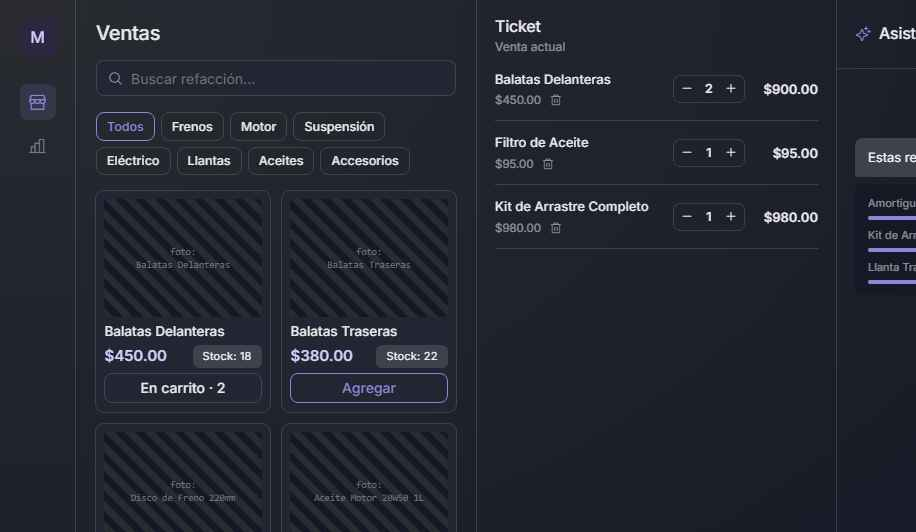
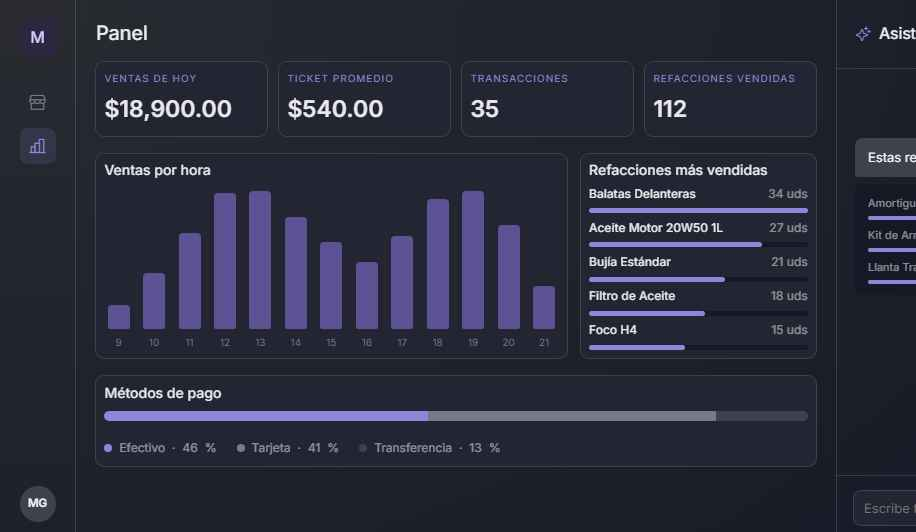
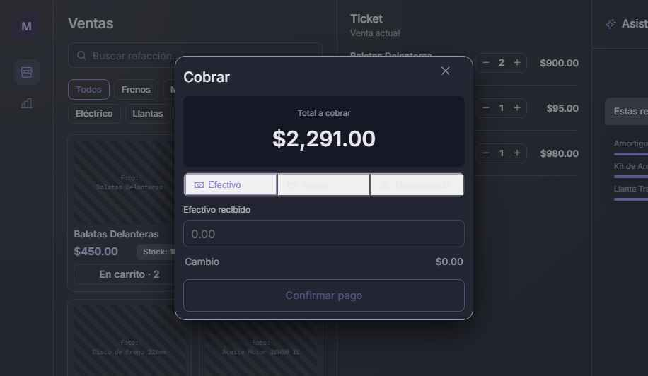

<div align="center">


### Punto de venta de escritorio que no se cae cuando se cae el internet

[](https://tauri.app)
[](https://www.rust-lang.org)
[](https://react.dev)
[](https://www.typescriptlang.org)
[](https://sqlite.org)
[](#descarga)

**[⬇ Descargar la última versión](../../releases/latest)**

</div>

---

## El problema

Una refaccionaria de motos en Guadalajara perdía ventas cada vez que se caía el internet. El punto de venta que usaban vivía en la nube: sin red, no había catálogo, no había precios, no había ticket. El mostrador se detenía.

Baza nació de ahí, y por eso está construido sobre una sola premisa:

> **El negocio no deja de vender porque falló la red.**

Todo vive en una base SQLite en el mismo equipo del mostrador. La sincronización con un servidor central existe como cola de cambios pendientes, pero es **opcional**: la aplicación es funcional al 100% sin conexión, y en máquinas modestas — 2 a 4 GB de RAM, CPU de doble núcleo, disco lento.

---

## Cómo se ve

<div align="center">



<sub>**Ventas** — búsqueda por nombre o lector de código de barras, categorías, ticket en vivo</sub>

<br><br>



<sub>**Panel** — ventas del día, ticket promedio, ventas por hora, productos más vendidos, desglose por método de pago</sub>

<br><br>



<sub>**Cobro** — efectivo, tarjeta, transferencia o mixto, con cálculo de cambio en vivo</sub>

</div>

---

## Qué hace

| Módulo | Qué resuelve |
|---|---|
| **Ventas y caja** | Cobro con lector de código de barras o búsqueda, pagos en efectivo / tarjeta / transferencia / mixto, descuentos, IVA, redondeo, devoluciones, producto genérico fuera de catálogo, reimpresión de ticket, apertura y cierre de caja con arqueo |
| **Inventario** | SKU y código de barras, categorías, múltiples almacenes, ajustes registrados como movimientos, alertas de existencia baja, costeo por línea de venta |
| **Clientes y facturación** | Perfil e historial, cuentas a crédito con abonos, datos fiscales completos para CFDI, emisión de comprobantes |
| **Proveedores y compras** | Catálogo de proveedores, órdenes de compra con recepción que alimenta el inventario |
| **Reportes** | Ventas por periodo, ticket promedio, más vendidos, ventas por hora, método de pago — exportables a PDF y CSV |
| **Usuarios y auditoría** | Tres roles jerárquicos, contraseñas con Argon2, PIN de supervisor para operaciones sensibles, bitácora de todo lo que toca dinero o inventario |
| **Asistente de IA** | *"¿Cuánto vendí ayer?"*, *"¿qué producto se está acabando?"* — las consultas frecuentes se resuelven con SQL directo, sin llamar al modelo. La mayoría cuesta cero tokens |
| **Módulos activables** | Lo que no todo negocio necesita se enciende por instalación. El primero: compatibilidad de refacciones por vehículo |

---

## Decisiones de ingeniería

Las cuatro que definen el proyecto:

**El dinero se maneja en centavos, siempre.** Ningún importe pasa por un `f64`. Un descuento del 33 % sobre un total impar no debe dejar un centavo perdido, y en un sistema que corta caja todos los días eso se nota.

**El inventario es *append-only*.** El stock no se decrementa con un `UPDATE`; se registra el movimiento y el stock se deriva de ahí. Permite reconstruir el historial completo y auditar cualquier diferencia — que es exactamente lo que se pregunta cuando falta mercancía.

**El offline se diseñó desde el esquema, no como parche.** La cola de sincronización con reintentos y *backoff* es parte del modelo de datos. `SyncAdapter` es un *trait*: el día que el negocio tenga servidor, se implementa y nada más cambia. Mientras tanto `NullSyncAdapter` falla de forma explícita en vez de fingir éxito.

**La lógica de negocio no vive en la UI ni en el SQL.** El backend está separado en capas — comandos, servicios, repositorios, dominio — para que una regla de negocio se lea en un solo lugar.

---

## Arquitectura

```
src-tauri/src/
├── commands/       # Puntos de entrada expuestos al frontend   (23 módulos)
├── services/       # Lógica de negocio y reglas                (18 servicios)
├── repositories/   # Acceso a datos, uno por entidad           (21 repositorios)
├── domain/         # Tipos núcleo: dinero, ids, fiscal, contraseñas, módulos
├── db/             # Conexión, migraciones y semillas
├── ai/             # Cliente, herramientas y atajos SQL del asistente
├── peripherals/    # Adaptadores de hardware (impresora, cajón, lector)
└── migrations/     # 15 migraciones SQL versionadas

src/
├── features/       # Una carpeta por módulo del POS
├── stores/         # Estado global con Zustand
├── api/            # Cliente tipado sobre los comandos de Tauri
├── adapters/       # Integraciones del lado del cliente
└── lib/            # Utilidades: dinero, fechas, CSV, PDF
```

| Capa | Tecnología |
|---|---|
| Shell de escritorio | Tauri 2 |
| Backend / lógica de negocio | Rust 2021 |
| Base de datos | SQLite vía `rusqlite`, migraciones con `rusqlite_migration` |
| Interfaz | React 19 + TypeScript 5.8 |
| Estado | Zustand |
| Build | Vite 7 |
| Hashing | Argon2 |
| PDF | jsPDF + AutoTable |
| Empaquetado | Instalador NSIS (Windows) con actualizaciones automáticas |

---

## Descarga

Los instaladores para Windows están en **[Releases](../../releases/latest)**. La aplicación se actualiza sola: revisa este repositorio al arrancar y aplica la nueva versión sin intervención del usuario.

Requisitos mínimos probados: Windows 10, 2 GB de RAM, CPU de doble núcleo.

---

## Estado

En producción desde su primera instalación real: una refaccionaria de motos en Guadalajara. Baza está pensado como **producto base reutilizable** — un núcleo genérico más módulos opcionales por instalación — no como software a la medida de un solo negocio.

El código fuente es privado. Este repositorio distribuye los instaladores y documenta el proyecto.

---

<div align="center">

Diseñado y desarrollado por **[Eduardo Alejandro López Villegas](https://github.com/aledev33)**
Guadalajara, Jalisco · [LinkedIn](https://linkedin.com/in/eduardolopez33)

© 2026 · Todos los derechos reservados

</div>
